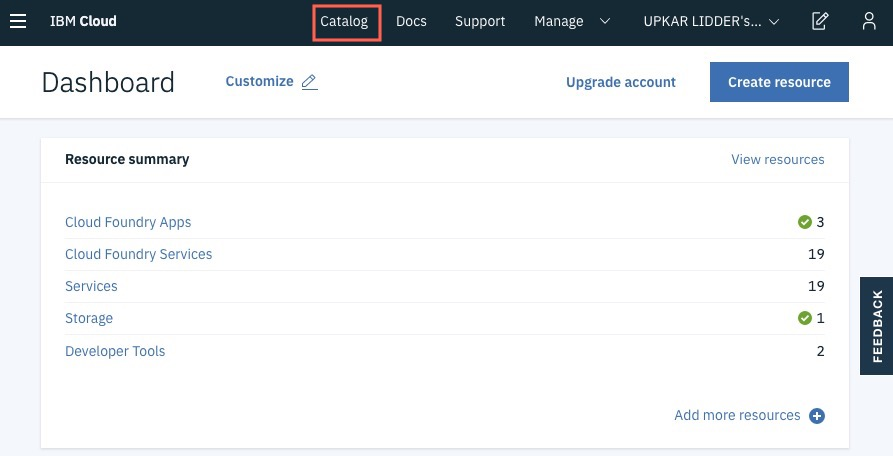
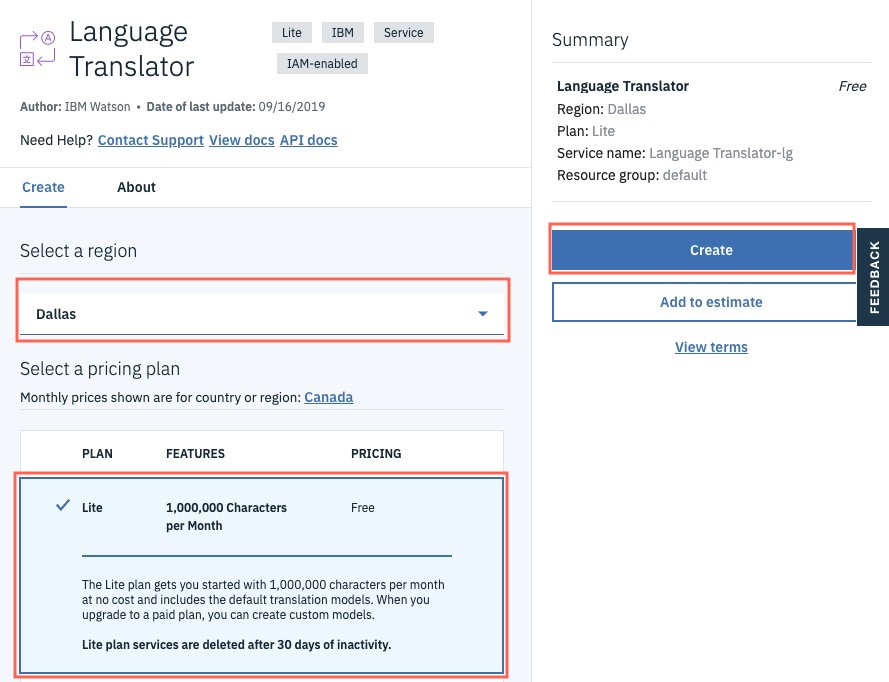
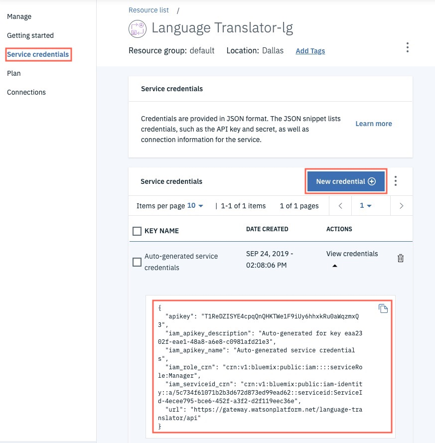

# Workshop for Containers Developer Summit
This workshop is an introduction to Docker, which is a runtime for containers. We will create a `containerized` Node.js application that provides a service to translate phrases from one language to another. The application uses the [IBM Language Translation service](https://www.ibm.com/watson/services/language-translator/).
## Environment
You can use one of the following environments for this workshop
1. Install `docker` locally using [Docker Desktop](https://www.docker.com/products/docker-desktop).
2. Use the web shell terminal provided to you at the workshop.

## Steps

### Step 1 - sign up on IBM Cloud
Sign up for IBM Cloud here: https://ibm.biz/containers-lab


### Step 2 - activate your account
Click on the link in the email you received from IBM to activate your cloud account. Make sure you check the spam folder in your email.
### Step 3 - create a language translation service
Log back into your IBM Cloud account using this URL: https://ibm.biz/containers-lab

Click on Catalog


Search `translator` to find the service. You can also find the service by navigating to the AI section on the left bar.


Click on the service to create a new instance. Pick the `Lite` plan on the next page and click `Create` to finish creating the service.



You will be redirected to the service landing page.
### Step 4 - copy the credentials to be used later
Click on `Service Credentials` on the left bar.



If you do not see a credential provided for you, you can create a new set of credentials. Save your `apikey` somewhere for the next section in this workshop.

**Congratulations!** You just signed up for IBM Cloud account and created your first `Language Translator` service. The next steps will show you how to build a Docker container for a Node.js application that provides an end point to translate text!

### Step 5 - clone repository
Open your local terminal or the web terminal provided in the workshop and change to the `/data` directory. Close this directory.
```
cd data
git clone https://github.com/lidderupk/nodejs-docker.git
```

### Step 6 - build the docker image
Change into the directory you just cloned and build the docker image
```
cd nodejs-docker
docker build -t <docker-username>/node-container .
```
The `docker-username` is required if you want to publish your image to [Dockerhub](https://hub.docker.com/). 
*If you do not have a Docker account - you would need to create one directly on hub.docker.com - choose sign up button.*

Alternatively, you can also build directly from github using the following command without cloning the repository: 
```
docker build -t <docker-username>/node-container https://github.com/lidderupk/nodejs-docker.git
```

This command uses the [Dockerfile](./Dockerfile) to download a Node.js 10 base image and then install our Express.js application on top. Let's explore the contents of this docker file ...

```
FROM node:10
```
... builds our image on top of the Node.js 10 image.

```
WORKDIR /usr/src/app
```
... creates a working directory for our application to live in.

```
COPY package*.json ./
```
... copies the `package.json` file to our working directory.

```
RUN npm install
```
... install our dependencies. We just have two dependencies in this application: `express` and `ibm-watson`.

```
COPY . .
```
... copy the rest of our source code into the docker image

```
EXPOSE 8080
```
... expose port 8080. We will still have to forward our local port to this docker container port later.

```
CMD [ "node", "server.js" ]
```
... starts the application by running `node server.js`.

### Step 7 - run the docker image
```
docker run -p 8080:8080 -e "nlp_key=<api_key>" -d <docker-username>/node-container
```

In my case, I would run

```
docker run -p 8080:8080 -e "nlp_key=T1ReDZISYE4cpqQnQHKTWe1F9iUy6hhxkRu0aWqzmxQ3" -d upkar/node-container
```

### Step 8 - test the application
```
curl "localhost:8080/translate?text=how%20are%20you"
```

You should see output as follows: 
```
{
  "translations": [
    {
      "translation": "¿Cómo estás?"
    }
  ],
  "word_count": 3,
  "character_count": 11
}%
```

The text is translated to Spanish `(en-sp)` by default. You can specify the langauge by passing in the lang flag as follows: 
```
curl "localhost:8080/translate?text=how%20are%20you?&lang=en-de"
```

You should now see the same text translated to German:  
```
{
  "translations": [
    {
      "translation": "Wie geht es Ihnen?"
    }
  ],
  "word_count": 3,
  "character_count": 12
}
```

Another example ...
```
curl "localhost:8080/translate?text=People+are+suffering.+People+are+dying+and+dying+ecosystems+are+collapsing.+We+are+in+the+beginning+of+a+mass+extinction%2C+and+all+you+can+talk+about+is+the+money+and+fairy+tales+of+eternal+economic+growth"


{
  "translations": [
    {
      "translation": "La gente está sufriendo. La gente está muriendo y los ecosistemas moribundos se están derrumbando. Estamos en el principio de una extinción masiva, y todo lo que se puede hablar es el dinero y los cuentos de hadas del crecimiento económico eterno"
    }
  ],
  "word_count": 39,
  "character_count": 204
}
```
in Polish

```
curl "localhost:8080/translate?text=People+are+suffering.+People+are+dying+and+dying+ecosystems+are+collapsing.+We+are+in+the+beginning+of+a+mass+extinction%2C+and+all+you+can+talk+about+is+the+money+and+fairy+tales+of+eternal+economic+growth&lang=en-pl"
{
  "translations": [
    {
      "translation": "Ludzie cierpią. Ludzie umierają, a umierające ekosystemy się zapadają. Jesteśmy na początku masowego wyginięcia, a wszystko, o czym można rozmawiać, to pieniądze i bajki o wiecznym wzroście gospodarczym"
    }
  ],
  "word_count": 39,
  "character_count": 204
}
```

You can see the supported languages `(both from and to)` in the [Language Translator documentation](https://cloud.ibm.com/docs/services/language-translator?topic=language-translator-translation-models).

**How cool was that!** You just containerzied a Node.js application that provides transation services.

## Clean up <OPTIONAL>
### Step 9 - stop the container
You can first stop the container. You need the container tag or the id to stop it. Let's look it up first

```
docker ps | grep node-container

419104eff9be        upkar/node-container                           "docker-entrypoint.s…"   3 minutes ago       Up 3 minutes                       0.0.0.0:8080->8080/tcp                            cranky_davinci
```
In my case, the container is called `cranky_davinci` and has an id of `419104eff9be`.

Stop the image with the following command. You can replace the id with your container id.

```
docker container stop 419104eff9be
```

### Step 10 - remove the container
Run the following command to remove the container. Replace the id with your container id identified in the step above.
```
docker container rm 419104eff9be
```
### Step 11 - remove the image
You can now delete the image. You again need the image id. 

```
$ docker images | grep node-container
upkar/node-container                       latest                         8baa6ca9cdac        5 minutes ago       958MB
```

Now, delete the image as follows.

```
$ docker image rm 8baa6ca9cdac
Untagged: upkar/node-container:latest
Deleted: sha256:8baa6ca9cdac8868d8e17642e90b433c7aa588a615b59ac9b528fb8635698a6e
Deleted: sha256:8c279f530b3ff260279f9cb8d22d167d748e53df4f6eab91b089b6c90b4da9f2
Deleted: sha256:9845fb86e05aa69c677dc999b6bbdeceafc460e70604092e0247e0f8880ec93e
Deleted: sha256:84ea0148452752e2aba0a1e1ef963355781a3fb87e485e9a440e8e8fc002d045
Deleted: sha256:f4f99031ae0d1cf0079d9981ef6e8dff2231eff670ac7ea4a4f27472282d7ad2
Deleted: sha256:bf579e37b35bb7b20ed0cb3140220118cbbd1d0564a512f21868568b3683a392
Deleted: sha256:07b958722eb2513e88186b2f6eddadcec0b8772001a598244352073ac5caf176
Deleted: sha256:361c46840912a7b9539b6ddf00164492fc594701085f0e2c9d2c1544bca8498c
```

## Troubleshooting
### Check container logs
You can check the logs for your container using
```
docker logs <container_id>
```

For example ...
```
root@terminal-5-846448d675-bk75j:/data# docker logs 4450279a9f50   


Running on http://0.0.0.0:8080
No language passed to translate to. Converting to Spanish by default.
{
  "translations": [
    {
      "translation": "Hola"
    }
  ],
  "word_count": 1,
  "character_count": 5
}
```

## Stretch goal
Congratulations again on creating your first docker container that hosts a Natural Language Translation service! Here is your next challenge if you choose to accept it!

**Create a second image using the same Node.js 10 base image. Run a container based on this image. This container will host a tone analyzer service on port 8081. The service should expose an end point of /analyze, accept a parameter called text and give back the sentiment score on it.** 

Here are some hints to get you started ...

1. Create and change to a different directory `/data/tone-container` and clone the github repo `https://github.com/lidderupk/nodejs-docker`.
2. Create a `Tone Analyzer` service from `IBM Cloud`. You can search for tone analyzer in the catalog and pick the `lite` plan.
3. Copy the credentials somewhere safe. You will need the `apikey` in the next few steps.
4. Change the `/translate` endpoint to `/analyze` and write the code to return sentiments for the text in the request parameter. You can find the code in the [API documentation for Tone Analyzer](https://cloud.ibm.com/apidocs/tone-analyzer?code=node#analyze-general-tone-get). If you are running out time, [I have provided sample code here](https://ibm.biz/tone-analyze-code).
5. Build a new image and call it `<docker-user>/tone-container`.
```
cd /data/tone-container/nodejs-docker
docker build -t upkar/tone-container .
```
6. Run a container based on the `<docker-user>/tone-container` image. Note that we are forwarding local 8081 to docker 8080. This is so that we don't create a conflict with the previous translator container.
```
docker run -p 8081:8080 -e "tone_key=<tone-analyzer-key>" -d upkar/tone-container

```
Make sure to change the `tone_key` to your tone analyzer key.

You should now have two containers running in your terminal ...
```
NAMES                       IMAGE                                            STATUS
inspiring_nash              upkar/node-container                             Up 4 minutes
quizzical_thompson          upkar/tone-container                             Up 5 minutes
```

Test your new tone analyzer container as follows ...

Example 1
```
curl "localhost:8081/analyze?text=life%20is%20good"
```

Result
```
{
  "document_tone": {
    "tones": [
      {
        "score": 0.83112,
        "tone_id": "joy",
        "tone_name": "Joy"
      }
    ]
  }
}
```


Example 2
```
curl "localhost:8081/analyze?text=People+are+suffering.+People+are+dying+and+dying+ecosystems+are+collapsing.+We+are+in+the+beginning+of+a+mass+extinction%2C+and+all+you+can+talk+about+is+the+money+and+fairy+tales+of+eternal+economic+growth"
```

Result
```
{
  "document_tone": {
    "tones": [
      {
        "score": 0.819121,
        "tone_id": "sadness",
        "tone_name": "Sadness"
      },
      {
        "score": 0.686032,
        "tone_id": "confident",
        "tone_name": "Confident"
      }
    ]
  },
  "sentences_tone": [
    {
      "sentence_id": 0,
      "text": "People are suffering.",
      "tones": [
        {
          "score": 0.830428,
          "tone_id": "sadness",
          "tone_name": "Sadness"
        }
      ]
    },
    {
      "sentence_id": 1,
      "text": "People are dying and dying ecosystems are collapsing.",
      "tones": [
        {
          "score": 0.840601,
          "tone_id": "sadness",
          "tone_name": "Sadness"
        }
      ]
    },
    {
      "sentence_id": 2,
      "text": "We are in the beginning of a mass extinction, and all you can talk about is the money and fairy tales of eternal economic growth",
      "tones": []
    }
  ]
}
```
